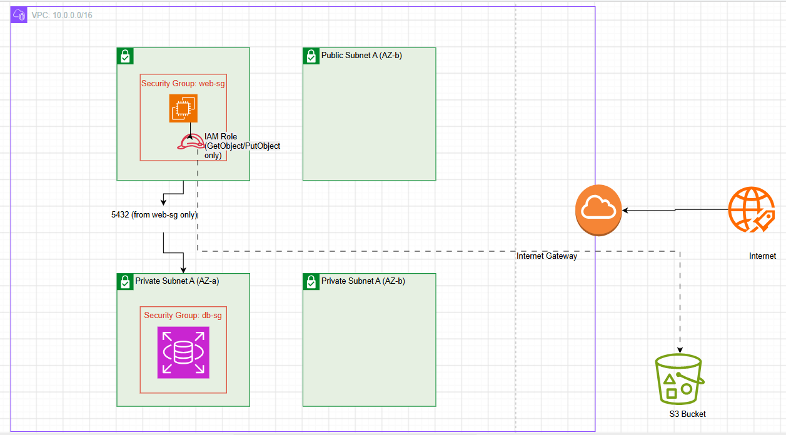

## Architectural Diagram



## Setup Instructions

These steps set up the **production** environment. Staging follows the exact same flow, just swap `environments/production` for `environments/staging` and use `staging.tfvars` instead of `production.tfvars`.

### 1. Prerequisites

- [Terraform](https://developer.hashicorp.com/terraform/install) >= 1.5
- [AWS CLI](https://docs.aws.amazon.com/cli/latest/userguide/getting-started-install.html) installed and configured
- An AWS account with permissions to create VPCs, EC2, RDS, S3, and IAM resources

### 2. Configure AWS credentials

Configure a named profile rather than using long-lived default credentials:

```bash
aws configure --profile vela
```

Set it as the active profile for your terminal session:

```bash
export AWS_PROFILE=vela
```

Verify you're authenticated as the expected identity before doing anything else:

```bash
aws sts get-caller-identity
```

### 3. Create the Terraform state backend bucket

State is stored remotely in S3. The backend bucket itself can't be created by the same Terraform run that uses it, so it's provisioned once via a separate bootstrap module.

```bash
cd infra/state-backend
terraform init
terraform apply
```

Note the `vela_state_bucket_name` output — this must match the `bucket` value in the `backend "s3"` block inside `environments/production/main.tf` (and `environments/staging/main.tf`) before continuing. If you changed the bucket name from the default, update both files accordingly, and try using a unique name for the state backend as well.

> This step only needs to be run once, ever, not per environment.

### 4. Deploy the production environment

```bash
cd infra/environments/production
terraform init
```

Copy `example.production.tfvars` to `production.tfvars` and fill in real values (your IP for SSH access, a globally unique S3 bucket name, and DB credentials).

```bash
cp example.production.tfvars production.tfvars
```

Preview the plan:

```bash
terraform plan -var-file="production.tfvars"
```

Apply once you're satisfied with the plan:

```bash
terraform apply -var-file="production.tfvars"
```

### 5. Staging

Identical flow, different folder:

```bash
cd infra/environments/staging
terraform init
cp example.staging.tfvars staging.tfvars   # fill in staging-specific values
terraform plan -var-file="staging.tfvars"
terraform apply -var-file="staging.tfvars"
```

Staging and production use separate state files in the same backend bucket (`staging/terraform.tfstate` vs `production/terraform.tfstate`), so they can be applied independently without conflict.

### 6. Tear down

```bash
terraform destroy -var-file="production.tfvars"
```

RDS will take a final snapshot before deletion in production (`vela_skip_final_snapshot = false`); staging skips this by default for faster teardown.

## Variable Reference

| Variable                    | Type           | Default                              | Controls                                                                                         |
| --------------------------- | -------------- | ------------------------------------ | ------------------------------------------------------------------------------------------------ |
| `vela_region`               | `string`       | `"ap-southeast-2"`                   | AWS region to deploy into                                                                        |
| `vela_main_vpc_cidr`        | `string`       | —                                    | CIDR block for the VPC                                                                           |
| `vela_public_subnet_cidrs`  | `list(string)` | —                                    | CIDR blocks for the two public subnets                                                           |
| `vela_private_subnet_cidrs` | `list(string)` | —                                    | CIDR blocks for the two private subnets                                                          |
| `azs`                       | `list(string)` | —                                    | Availability Zones the subnets are spread across                                                 |
| `vela_admin_ip_cidr`        | `string`       | —                                    | Your IP (in`/32` CIDR notation) allowed to SSH into the EC2 instance                             |
| `vela_instance_type`        | `string`       | `"t2.micro"`                         | EC2 instance type                                                                                |
| `vela_s3_bucket_name`       | `string`       | —                                    | Globally unique name for the S3 static-assets bucket                                             |
| `vela_db_username`          | `string`       | —_(required, no default, sensitive)_ | RDS master username                                                                              |
| `vela_db_password`          | `string`       | —_(required, no default, sensitive)_ | RDS master password                                                                              |
| `vela_skip_final_snapshot`  | `bool`         | `true`                               | Whether RDS skips a final snapshot on`terraform destroy` — set to `false` in `production.tfvars` |

## Design Decisions

**Private subnets for RDS, with an explicit private route table.**
RDS never needs to be reachable from the internet, so it lives entirely in private subnets. I could have relied on the VPC's default main route table for this (any subnet not explicitly associated falls back to it), but I created a separate, explicit private route table with no internet route instead. If someone later adds an internet-bound route to the main route table for an unrelated reason, private subnets wouldn't silently become public.

**IAM role instead of access keys for EC2 → S3 access.**
The EC2 instance needs to read/write objects in the S3 bucket, but I didn't want to bake AWS access keys into the instance or its user data, that's a long-lived credential that has to be manually rotated and can leak if the instance is compromised. Instead, the instance assumes an IAM role via an instance profile, which gives it short-lived, automatically-rotated credentials. The role's policy is scoped to exactly `s3:GetObject` and `s3:PutObject` on one bucket's ARN, so even if the instance were compromised, the blast radius is one bucket and two actions, not the whole account.

**`db-sg` references `web-sg` by security group ID, not by CIDR block.**
Instead of hardcoding the EC2 instance's private IP (or subnet CIDR) into `db-sg`'s inbound rule, I referenced `web-sg` directly. AWS evaluates this dynamically, any resource currently attached to `web-sg` is allowed through on port 5432, automatically, with no need to update `db-sg` if the EC2 instance's IP changes or if I scale to multiple instances later.

**Split into reusable modules instead of one flat configuration.**
I structured the code as four independent modules (`networking`, `compute`, `database`, `storage`) called from separate `staging` and `production` environment folders, rather than one long `main.tf`. The two environments share identical module code and only differ in their `.tfvars` values and remote state key, so a config change to, say, the security group rules only has to happen once, in one file, and both environments pick it up.

**Terraform state stored remotely in S3, provisioned by a separate bootstrap module.**
Rather than leaving state local (which breaks collaboration and risks loss if my machine dies), I set up a dedicated `state-backend` module that provisions the S3 bucket state lives in. It has to be its own separate root module using local state, since a `backend "s3"` block can't provision the very bucket it depends on.

**RDS final snapshot behavior differs by environment, controlled by one variable.**
The Part 6 bonus asks for an automated snapshot before any `terraform destroy`. Rather than hardcoding `skip_final_snapshot` on the RDS resource, I exposed it as a variable (`vela_skip_final_snapshot`) that flows from the environment's `.tfvars` down through the database module. Staging defaults to skipping the snapshot, it's throwaway data, and skipping means faster teardown during iteration. Production sets it to `false`, so a snapshot is always taken automatically before the instance is destroyed. Since `final_snapshot_identifier` includes a timestamp (needed because AWS requires a unique name each time), I added a `lifecycle { ignore_changes = [...] }` block so Terraform doesn't treat that ever-changing value as drift on every plan.
